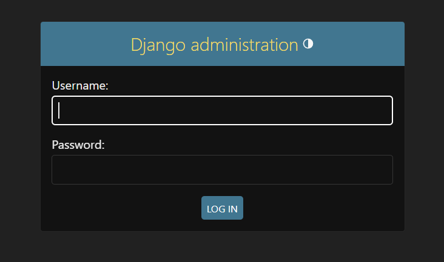
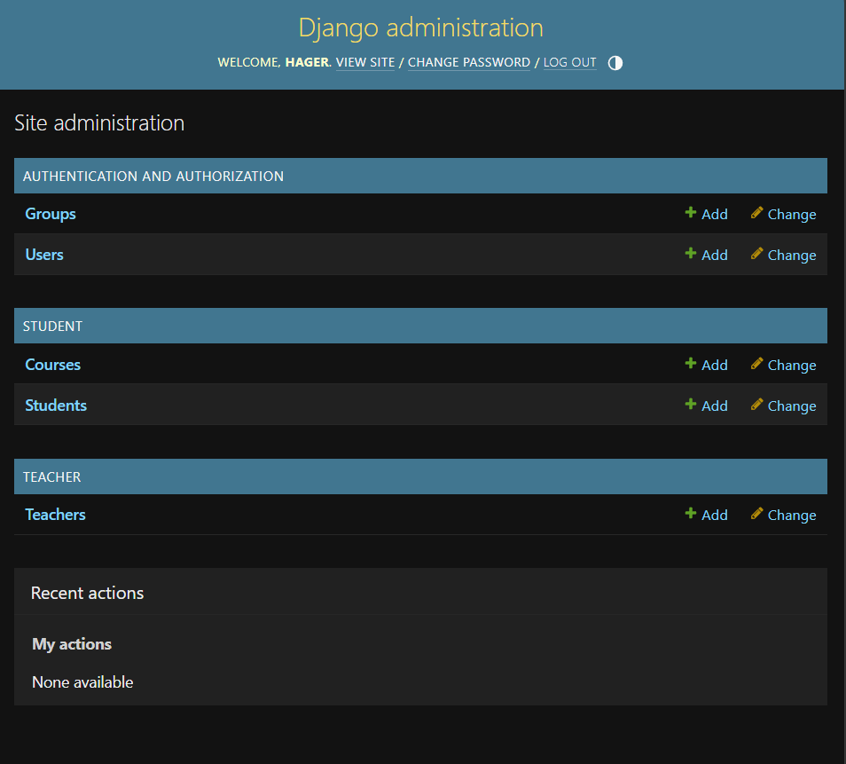
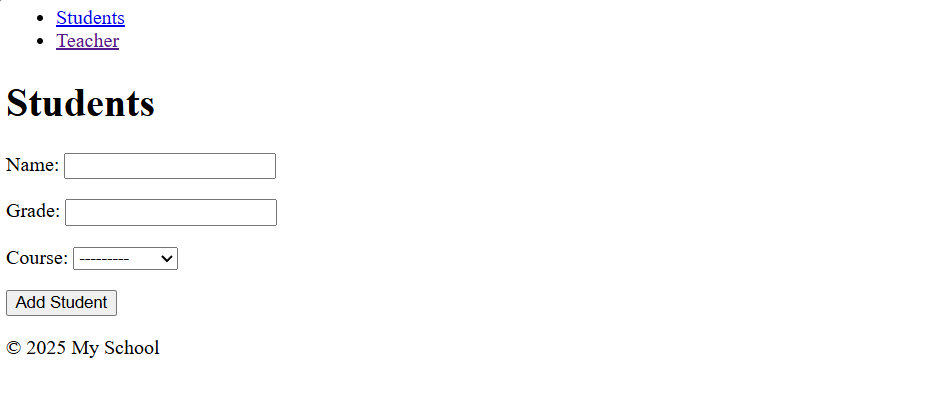
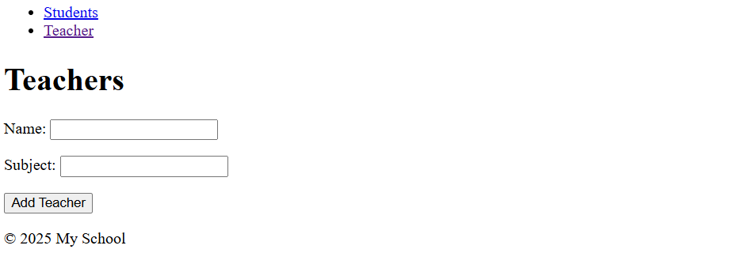

# School Management System

A simple school management system built using Django and SQLite.

## Features
- Add teachers
- Manage students
- Django admin panel
- Forms validation
- SQLite database integration

## Technologies Used
- Python
- Django
- SQLite
- HTML

## Project Structure
school_project/
│
├── student/
├── teacher/
├── templates/
├── manage.py

## Run The Project

```bash
python manage.py runserver

## Screenshots




